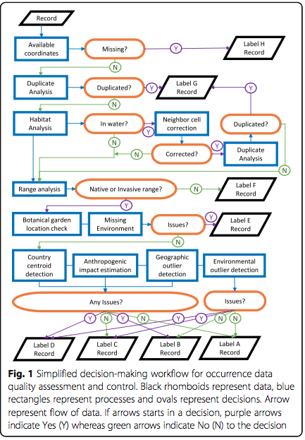

```{r setup, include=FALSE}
knitr::opts_chunk$set(echo = TRUE)
knitr::opts_chunk$set(cache = TRUE)
```

# What does occTest do?

*occTest* implements a workflow to integrate, assess and control data quality of species occurrences, and is especially designed species distribution analysis and modelling. The quality control workflow follows a hierarchical procedure (Figure 1; see Serra-Diaz et al. 2018) and profiles the occurrences according to several checks on the coordinates and environmental layers. Profiling should not be understood as data cleaning, but rather as the application of several test and a labelling scheme that enables the user to characterize the occurrence records. Such profiling should enable the user to characterize the data at hand. This is differs from the more classical approach of data selection, cleaning or scrubbing, but it is obviously a critical step prior to selecting data for a given analysis. 

The packages is based on a combination of new created functions, and a wrapper of functions from packages biogeo (Patterson et al. ) and CoordinateCleaner(Zizka et al. ).

 


## Workflow overview and data needed

The main function, that implements the workflow is called *occurrenceProfile*. The workflow is divided in several steps detailed below, but it consist of two main procedures: the filtering procedure and the analysis procedure (Fig.1). The filtering procedure flags occurrences that are not useable for SDMs and a strong correction of the coordinates is needed (see biogeo package for potential solutions). The analysis procedure undertakes several analysis (e.g. geographical outliers, environmental outliers) using multiple tests in each analysis in order to assess (e.g. 'profile') potential errors.  


The workflow NEEDS a MINIMUM of two objects: 

1. Species occurrence dataset (data.frame) 
The species occurrence data.frame contains the presence records in latitude-longitude WGS84 geographic coordinate system, with the following potential field, but namings of the table fields may be flexible by the user.  
2. Environmental raster (rasterStack), with quantitiative continuous variables such as a climate.
The environment raster is a rasterStack object that contains the climate variables intended for use in an SDM or another analysis relating species occurrence and climate. 


## Function specifications

Many specifications may be set to profile occurrences, although not all will be useful in all cases. We explain here the main parameters of the main function called occurrenceProfile


| Data    | Description     | occurrenceProfile parameter  |
| ----------   |:------------------------------:| -------:|
species name | (compulsory) a character with species name, separated by a space in the form Genus species | sp.name
Coordinates table | (compulsory) right now, only longitude-latitude coordinates are accepted, column names should be noted 'x' and 'y' respectively, but they can modified in the settings | x.field
environmental raster data | rasterStack with the environmental data for analysis | r.env


Have more info? Use the settings

We provide default specifications for the analysis, but you can easily overwrite them and create your custom analysis. This is especially useful when you have more detailed information on your target species.


elevation | elevation in meters | e.field
country | country of the record, right now implemented as ISO3 code | c.field
location/locality | toponim,locality description | l.field
coordinate uncertainty | coordinate uncertainty in meters, can be a vector with many fields corresponding to errors in X,Y | a.field
dataset | name of the dataset to which the record corresponds | ds.field

## *occurrenceProfile* output

The outputs of occurrenceProfile is a list with two elements:

1. occ_full_profile : a dataframe with all the fields used in the analysis  
2. occ_short_profile :a dataframe with coordinates , and the profile labeling system

## Profile labeling scheme

To ease the rapid interpretation of many analyses we developed a labeling system to quickly describe data in terms of quality for SDMs. Each label is composed of two elements: a grade (ranging from A to H, capital letter) and a qualifier(s) (letter(s) that further describes the occurrence record). Grades are meant to identify potential quality issues that compromise or largely affect SDMs, while qualifiers are meant to indicate that the selection of a particular occurrence is tied to a specific use. For instance, grades will help you differentiate between duplicated records, or missing coordinates, and qualifiers will inform you whether the record has a timestamp or whether it is in an invasive or native region 
Example:  
A record is characterized by the profiling label *A/n-t-p*  
This means:  
*Grade*     : A  no apparent errors found  
*Qualifiers*: n (occurrence in the native range)  
              t (timestamp available in the occurrence record)  
              p (coordinate precision ok)  

Grade labels currently implemented:    


| Label         | Label name                                                | Other info  |
| ---- |:-----------------------------------------:| -----------------:|
| H             | Missing coordinates                                       | |
| G             | Duplicated records                                        |   Either raster cell dups or exact coordinate dups |
| F             | Unknown range or wrongly reported                         | |
| E             | Wrong (or unlikely) environment      |Missing environmental info, or in botanic garden or sea |
| D             | Geographic and Environmental issues       |Flags for both geographical and environmental space have been raised in the analysis|
| C             | Environmental issues     |  Flags environmental space have been raised in the analysis|
| B             | Geographical issues      |    Flags geographical space have been raised in the analysis|
| A             | No issues detected      |   No issues detected|


Qualifiers  currently implemented

| Qualifier label         | Qualifier description                                             
| ------------- |:---------------------------------------------------------:|
| t             | timestamp present in the record                             | 
| p             | good precision with respect tot the environmental raster provided |   
| i             | record in the invasive range                      | 
| n             | record in the native range      |Missing environmental info, or in botanic garden or sea |
| e             | record with elevation difference between elevation raster and recorded elevation less than a given threhsold   

## The occTest workflow step by step

### Step 1: Filter missing data and geographical errors [FILTER PHASE]
First, the workflow checks whether there are missing data with the *filterMissing* function.

| Function name    | What it does...      | Output  |
| ----------   |:------------------------------:| -------:|
| filterMissing    | Filters records with missing coordinates |  list with two elements 'stay' (dataframe with filtered records); 'continue' (dataframe with elements that passed the test)

Then it checks whether the coordinates are in geographic latlong WGS84 and performs three tests in the CoordinateCleaner package: the zero long zero latitude, and decimal conversion errors. If errors are found, these records are filtered from subsequent analysis, and categorized as H. 

### Step 2: Filter duplicate records [FILTER PHASE]
Records are checked to see if these are duplicated. We differentiate whether records are exact coordinate duplicates, or whether they are they are duplicates in the environment, meaning they fall within the same environmental grid cell.

| Function name    | What it does...                                                | Output  |
| -------------    |:------------------------------------------------:| --------------------:|
| duplicatesexcludeAnalysis    | Filters duplicates AND differentiates between exact duplicates and raster cell duplicates |  list with two elements 'stay' (dataframe with filtered records); 'continue' (dataframe with elements that passed the test)

### Step 3: Sea/Terrestrial potential reassignment [FILTER PHASE]
Check whether species are in an incorrect habitat (e.g. sea for a terrestrial species) and tries to correct it. Correction happens when a neighbor cell in the environmental raster has environmental data (unlike the target cell). If records could be corrected, then it goes back to step 2 to check for duplicates again. Based on the correction methods in packages biogeo.

| Function name    | What it does...                                                | Output  |
| -------------    |:------------------------------------------------:| --------------------:|
| nearestcell3    | Moves sea records to terrestrial coordinates, an original record is kept |  if list => two elements 'moved' (dataframe with moved coordinates); 'not moved' 

### Step 4: Country-related range analysis [OPTIONALLY FILTER PHASE]
In this step we perform the analysis to know whether the species is outside of the countries where it is considered native or invasive, or to see whether it is out of the recorded country. If no information on native or invasive range, then all records are considered good and the analysis continues to step 5. 

This analysis may be filter records for subsequent steps or not(the default). If users want to set this test as a test, and thus highlight records not found in known ranges, then they can set *excludeUnknownRanges*=T and *excludeNotmatchCountry*=T in *occurrenceProfile* function.

| Function name    | What it does...                                                | Output  |
| -------------    |:---------------------------------------------------------:| -----------:|
| countryStatusRangeAnalysis    | Checks three things: is the species in the native range country ? is the species in the invasive range country? is the species recorded in a country different than the country extracted from coordinates? |  by default (unless excludeUnknownRanges= T OR excludeNotmatchCountry= T in the workflow), added columns for each of this tests with values 1/0/NA.


### Step 5: Geoenvironmental analysis
Perform several tests to flag environmental and geographical issues of the records. All records that have not been filtered in Steps 1-4 are passed through a set of different functions specified below. 

| Function name    | description of the tests                                               
| -------------    |:---------------------------------------------------:|
| centroidDetection    | is record  found in a centroid of a political entity? | 
| HumanDetection  | is record found in a highly human environment (agriculuture, urban areas)? | 
| institutionLocality  | is record found near an institution (GBIF, botanic garden)? |
| geoOutliers    | is record a geographical outlier?  |
| envOutliers    | is record an environmental outlier? |
| geoEnvAccuracy    | tests whether the coordinates are precise and whether they may compromise the accuracy of environmnetal data? |  

Each of these functions aims at identifying different potential errors of occurrence records. However, different methods have been implemented to identify them. In occTest we implement an ensemble testing. That is, the default is to test different methods for each of the functions and output a score that average the results. For instance, detecting geographical outliers can be performed using different methods: by using distances between points, by using coordinate distributions, by using alpha hull geometries. occurrenceProfile tests all of them and outputs 1 or 0 for each method, and a total score ranging from 0 to 1 for geographical outlier detection. The user may, however, specify which tests to perform although our default and recommendation is to use them all (method='all' in all functions above). 

| Function name    | methods                                               
| -------------    |:---------------------------------------------------:|
| centroidDetection    |'BIEN'  |
| centroidDetection    |'speciesGeoCodeR' |
| centroidDetection    |'CoordinateCleaner', implemented from the DB of centroids from the pckg with the same names  |
| HumanDetection    |'hii' using the human influence index from NSDIC  | 
| HumanDetection    |'urban' using human areas from the naturalearth website | 
| institutionLocality    |'fromBotanicLocalityName' using text recognition pattern to identify different names associated with botanical records in the field locality  | 
| institutionLocality    |'fromCoordinates' matching coordinates of the record with known institution coordinates  | 
| geoOutliers    | 'alphahulls' using alpha hull geometry (alpha parameter=2) to destinguish point out of the alpha hull |  
| geoOutliers    | 'distance' outliers ar flagged if the minimum distance to the next record of the species is >   .distance.parameter (default 1000, but can be changed). Check ?CoordinateCleaner::cc_outl for further info |  
| geoOutliers    | 'median' outliers are identified *if the mean distance to all other records of the same species is larger than the median of the mean distance of all points plus/minus the mad of the mean distances of all records*. Check ?CoordinateCleaner::cc_outl for further info|  
| geoOutliers    | 'quantSamplingCorrected' use mean distances to identify outliers, but based on country specific sampling intensity. Check ?CoordinateCleaner::cc_outl for further info |  
| geoOutliers    | 'grubbs' uses three tests dicussed by Grubbs (1950) to identify outliers. Check ??outliers::grubbs.test for further information |  
| envOutliers    | 'bxp' uses boxplot statistics to idientify an outlier. Check ?biogeo::outlier for further information  |  
| envOutliers    | 'grubbs' uses three tests dicussed by Grubbs (1950) to identify outliers. Check ??outliers::grubbs.test for further information |  
| geoEnvAccuracy    | 'lattice' checking potential errors when data comes from catalogue data. See ?CoordinateCleaner::cd_round for further information |  
| geoEnvAccuracy    | 'percDiffCell' given a field(s) of coordinate accuracy, identify if the occurrence could be >50% in a different cellfrom the original coordinates (reported coordinates) |  
| geoEnvAccuracy    | 'envDeviation' given a field(s) of coordinate accuracy, identify if the occurrence deviates environmentally from the original coordinates (reported coordinates) |  
| geoEnvAccuracy    | 'elevation': given an elevation field, identify occurrences for which the reported elevation and the elevetion in the cell is more than 100m |

### Step 6: Perform the quality grading system 

In this step we use the different checks performed (filtering occurrences in steps 1-4 and analysis in step 5)to implement a grading system that allows each record to be labeled (e.g profiled, see section on label scheme). 

| occurrenceProfile Parameters    |  it does...                                                | options  |
| -------------    |:---------------------------------------------------:| ----------------:|
| grading.test.type    | When multiple tests are implemented for a given type of check (e.g geographical outliers), you need to decide how much you are willing to accept.  | charachter. 'majority' flags errors where >50% of the methods in step 5 raised a flag. Other options are 'strict' (>0%) and 'relaxed' (>60%)|
| qualifiers    | Logic. TRUE or FALSE   | it implements tags to characterize the label, to quickly identify whether you have timestamp in the record, or if it is in the native or invasive range|
| qualifier.label.scoping    | character. Defalut is all labels implemented c('A','B','C','D','E')   | it implements tags to characterize the label, but you can choose in which labels you want to implement those tags. For instance, you may be interested to know these details for label A or B, then you should change that parameter|


### Step 7: Write outputs 

In this last step, we write the desired outputs.

| occurrenceProfile Parameters    | options                                                | What it does  |
| -------------    |:---------------------------------------------------:| ----------------:|
| write    |  Logic. Default to F. Overwrites write.simple.output and write.full.output   | It writes two csv files with the profiled records |
| write.simple.output    |Logic. Default to F  | It writes the csv files with the profiled records, with a limited number of information |
| write.full.output    |Logic. Default to F  | It writes the csv files with the profiled records, with a all analysis outputs|
| output.base.filename    |Character. Default to 'QAQC'  | suffix used to write the output files|

# Example 1: Making the function turn

```{r}
#load packages
library(occTest)
library(ggplot2)
library(raster)
library(knitr)
library(rgdal)
```


```{r,fig.width=6,fig.height=4}
#load data
occ.species.nogeoscrub.f = system.file('ext/SampleData/Sp3Occurrence_v4.csv'
                                     ,package='occTest')
occ.species.nogeoscrub <-  read.table (file = occ.species.nogeoscrub.f,header = T,sep = ',',as.is = T)
countries.pol.f = system.file('ext/CountryLevel',package='occTest')
# # I assume this path was because readOGR doesn't take relative paths, right? I think this works now, so delete the commented stuff if you're satisfied.
# if(Sys.info()["user"]=='pepserra'){ dsn='/Users/pepserra/Documents/RS/occTest/Rpackage/inst/ext/CountryLevel'}
# if(Sys.info()["user"]=='ctg'){ dsn='/Users/ctg/Dropbox/Projects/R_Packages/occTest/occTest/Rpackage/inst/ext/CountryLevel'}
#countries.pol = readOGR(dsn = dsn,layer='Countries_SPDF_MED')
countries.pol = readOGR(dsn = countries.pol.f,layer='Countries_SPDF_MED')

ras.env.f = system.file('ext/AllEnv.tif',package='occTest')
ras.env = raster::stack(ras.env.f)

ras.dem.f = system.file('ext/DEM.tif',package='occTest')
ras.dem = raster(ras.dem.f)

ras.humaninfluence.f = system.file('ext/HII.tif',package='occTest')
ras.humaninfluence = raster(ras.humaninfluence.f)
```
The sample species is a Mediterranean that is present in France, Spain and Andorra. But the information of the species is however variable. Some records have the date collected, other records have data on the elevation, others have information on the locality, etc... 

```{r}
#prepare projections and plot data
occ.sp <- occ.species.nogeoscrub[,c('MAPX','MAPY')]
occ.sp <- occ.sp [complete.cases(occ.sp),]
coordinates (occ.sp) <-  ~ MAPX + MAPY
occ.sp@proj4string <- sp:::CRS (projection (ras.dem))
plot(ras.dem)
plot(occ.sp, cex=1,add=T)

#inspect data information in occurrence table
head(occ.species.nogeoscrub)
tail(occ.species.nogeoscrub)
```

In this first example we are going to profile the data with the minimum number of parameters. Here we obviate the information on time, country of record, elevation...just presence and absence note here that we indeed add a native country (Spain) and an invasive country (France).
  
```{r,fig.width=6,fig.height=4}
occ.profiled.1=occurrenceProfile(output.dir = getwd(),
                                 sp.table = occ.species.nogeoscrub,
                                 sp.name = "my Species",
                                 r.env = ras.env,
                                 r.dem = ras.dem ,
                                 countries.shapefile = countries.pol,
                                 countryfield.shapefile = 'ISO',
                                 #ntv.ctry = c('ESP'),
                                 #inv.ctry = c('FRA') ,
                                 ras.hii = ras.humaninfluence,
                                 x.field = 'MAPX' ,
                                 y.field = 'MAPY')
```

Check the results: The result is a list
The first element is a data.frame with all the columns and information of the analysis

<!-- CM: should we omit all the columns for tests that weren't run? -->
```{r}
class(occ.profiled.1)
head(occ.profiled.1[[1]])
```

The second element of the list is the short version with only coordinates and quality labels
```{r}
head(occ.profiled.1[[2]])
```

Now, take a look at the different quality grades, qualifiers and quality.labels
```{r}

#take a look at the diferent quality grades
table(occ.profiled.1$occ_short_profile$quality.grade)
#take a look at the diferent qualifier tags
table(occ.profiled.1$occ_short_profile$qualifiers)
#take a look at the diferent quality lables
table(occ.profiled.1$occ_short_profile$quality.label)
```

Map the results

```{r, fig.height=4,fig.width=6}
full.qaqc <-occ.profiled.1$occ_full_profile
proposed.color.grading <- data.frame (row.names =
                                        c('A','B','C','D','E','F','G','H'),
                                      color.qgrade=c('#4575b4','#74add1',
                                                     '#abd9e9','#e0f3f8',
                                                     '#fee090','#fdae61',
                                                     '#f46d43','#d73027'))
color.to.plot<-as.character(sapply(full.qaqc$quality.grade,
                                   function (x){
                                     proposed.color.grading[x,'color.qgrade'] }))
plot(ras.dem)
points(x=full.qaqc$MAPX,y=full.qaqc$MAPY,col='black',pch=22,bg=color.to.plot)
```

distribution of the quality of the plots

```{r,fig.width=6}
#distribution of the quality of the plots
dat.to.plot <- full.qaqc
dat.to.plot$grade.color<- color.to.plot
ggplot (aes(x=quality.grade,fill=quality.grade),data = dat.to.plot)+
  geom_bar() +
  ggtitle('Example 1')
```

#Example 2: Adding supplementary info on elevation, time, locality and coordinate uncertainty

Adding this information allows for different qualifiers to be named so we have a better grasp of the quality of the data
```{r}

occ.profiled.2=occurrenceProfile(output.dir =getwd(),
                                 sp.table = occ.species.nogeoscrub,
                                 sp.name = "My species",
                                 r.env = ras.env,
                                 r.dem = ras.dem ,
                                 countries.shapefile = countries.pol,
                                 countryfield.shapefile = 'ISO',
                                 ntv.ctry = c('ESP'),
                                 inv.ctry = c('FRA') ,
                                 ras.hii = ras.humaninfluence,
                                 x.field = 'MAPX' ,
                                 y.field = 'MAPY',
                                 #added info
                                 t.field = 'DATE',
                                 e.field = 'ELEVATION',
                                 l.field = 'LOCALITYNAME')

# (because now we can track botanical gardens (e.g. new class E together with missing environment))
table(occ.profiled.1$occ_short_profile$quality.grade)
table(occ.profiled.2$occ_short_profile$quality.grade)

```
we now also have more quality tags added

```{r}
# (we have the tag T, meaning we have a timestamp in the record, and the tag e, meaining that the elevation recorded and the elevation extracted is less than 100m (default))
table(occ.profiled.1$occ_short_profile$qualifiers)
table(occ.profiled.2$occ_short_profile$qualifiers)

#take a look at the diferent quality lables
table(occ.profiled.2$occ_short_profile$quality.label)
```
we have the tag T, meaning we have a timestamp in the record, and the tag e, meaining that the elevation recorded and the elevation extracted is less than 100m (default)


Let's now map the results

```{r,fig.height=4,fig.width=6}
full.qaqc.2 <-occ.profiled.2$occ_full_profile
color.to.plot.2 <- as.character (sapply (full.qaqc.2$quality.grade, 
  function (x){proposed.color.grading[x,'color.qgrade'] }))
plot (ras.dem)
points (x =full.qaqc.2$MAPX ,y=full.qaqc.2$MAPY ,col='black',pch=22,cex=0.1,
        bg=color.to.plot,text(full.qaqc.2$MAPY~full.qaqc.2$MAPX, 
                              labels =full.qaqc.2$quality.grade,pos=2))
```

distribution of the quality of the plots
```{r,fig.width=6}
dat.to.plot <- full.qaqc
dat.to.plot$grade.color<- color.to.plot
ggplot (aes(x=quality.grade,fill=quality.grade),data = dat.to.plot)+
  geom_bar() + ggtitle('Example 2')
```

# Example 3:  Adding info on country record 

Adding the information on country record collected may dramatically change the results. There are two ways to implement it, either in a restrictive way or in non-restrictive way.

If implemented in a restrictive way, the grading system will hugely downgrade any recored with a wrong or ABSENT country of reference name.

We recommend only to enable this feature if all the countries of the records are provided, as any NA will be considred as a 'very low quality' record.
<!-- CM: this example broke for me -->

<!-- ```{r,fig.width=6} -->
<!-- #adding the information on country record collected may dramatically change the results -->
<!-- #the grading system will hugely downgrade any recored with a wrong or ABSENT country of reference name. -->
<!-- #we recommend only to enable this feature if all the countries of the records are provided, as any NA will be considred as a 'very low quality' record -->

<!-- occ.profiled.3<-occurrenceProfile(output.dir=getwd(), -->
<!--                                   sp.table = occ.species.nogeoscrub, -->
<!--                                   sp.name = "My species", -->
<!--                                   r.env = ras.env, -->
<!--                                   r.dem = ras.dem , -->
<!--                                   countries.shapefile = countries.pol, -->
<!--                                   countryfield.shapefile = 'ISO', -->
<!--                                   ntv.ctry = c('ESP'), -->
<!--                                   inv.ctry = c('FRA') , -->
<!--                                   ras.hii = ras.humaninfluence, -->
<!--                                   x.field = 'MAPX' , -->
<!--                                   y.field = 'MAPY', -->
<!--                                   t.field = 'DATE', -->
<!--                                   e.field = 'ELEVATION', -->
<!--                                   l.field = 'LOCALITYNAME', -->
<!--                                   #we now added info on the country record -->
<!--                                   c.field = "COUNTRYRECORD", -->
<!--                                   #and we enable restrictive analysis -->
<!--                                   excludeUnknownRanges = T,excludeNotmatchCountry = T) -->

<!-- #check: only three classes now, almost all corresponding to category F -->
<!-- full.qaqc <-occ.profiled.3$occ_full_profile -->
<!-- ggplot (aes(x=quality.grade,fill=quality.grade),data = full.qaqc)+geom_bar() +ggtitle('Example 2') -->
<!-- ``` -->

# Example 4: Without information on native range
setting to NULL the ntv.ctry will make the grading system shift, as now everything is considered native range

```{r,fig.width=6}
#setting to NULL the ntv.ctry will make the grading system shift, as now everything is considered native range
occ.profiled.4<-occurrenceProfile(output.dir=getwd(),
                                  sp.table = occ.species.nogeoscrub,
                                  sp.name = "My species",
                                  r.env = ras.env,
                                  r.dem = ras.dem ,
                                  countries.shapefile = countries.pol,
                                  countryfield.shapefile = 'ISO',
                                  #changed info on ntv.ctry
                                  ntv.ctry = NULL ,
                                  inv.ctry = c('FRA') ,
                                  ras.hii = ras.humaninfluence,
                                  x.field = 'MAPX' ,
                                  y.field = 'MAPY',
                                  t.field = 'DATE',
                                  e.field = 'ELEVATION',
                                  l.field = 'LOCALITYNAME')
full.qaqc.4 <-occ.profiled.4$occ_full_profile

#check: only three classes now, almost all corresponding to category F
#note that the point from Andorra has incrased
#also note, however, that this changes the way the range is computed, as well as the potential outliers.
#for instance, the inclusion of the point of Andorra changed also the categorization of geographical outliers, because we include this point now in the alphahull calculation
#therefore, accepting all countries as native countries can have impacts on the grading system.

#check
ex2 <- full.qaqc.2[,c('ID_GRAFIC','quality.label')]
names (ex2) <- c('ID_GRAFIC','Q.2')
ex4 <- full.qaqc.4[,c('ID_GRAFIC','quality.label')]
names (ex4) <- c('ID_GRAFIC','Q.4')
kable(plyr::join (ex2,ex4))
```

# Example 5: Without information invasive range

setting to NULL THE ntv.ctry will make the grading system to classify potential ranges
it can thus affect outlier detection, as those records are not part of the outlier detection.
```{r}
occ.profiled.5<-occurrenceProfile(output.dir=getwd(),
                                  sp.table = occ.species.nogeoscrub,
                                  sp.name = "My species",
                                  r.env = ras.env,
                                  r.dem = ras.dem ,
                                  countries.shapefile = countries.pol,
                                  countryfield.shapefile = 'ISO',
                                  #changed info on ntv.ctry
                                  ntv.ctry = c('ESP') ,
                                  inv.ctry = NULL ,
                                  ras.hii = ras.humaninfluence,
                                  x.field = 'MAPX' ,
                                  y.field = 'MAPY',
                                  t.field = 'DATE',
                                  e.field = 'ELEVATION',
                                  l.field = 'LOCALITYNAME')

```

check: only three classes now, almost all corresponding to category F
note that the point from Andorra has incrased
also note, however, that this changes the way the range is computed, as well as the potential outliers.
for instance, the inclusion of the point of Andorra changed also the categorization of geographical outliers, because we include this point now in the alphahull calculation
therefore, accepting all countries as native countries can have impacts on the grading system.
 

#check, a lot of F appeard (unknown range)
full.qaqc.5 <-  occ.profiled.5[[1]]
ex5 <- full.qaqc.5[,c('ID_GRAFIC','quality.label')]
names (ex5) <- c('ID_GRAFIC','Q.5')
#analyze de difference between the two
jex45 = plyr::join (ex4,ex5)
kable(jex45)
```

